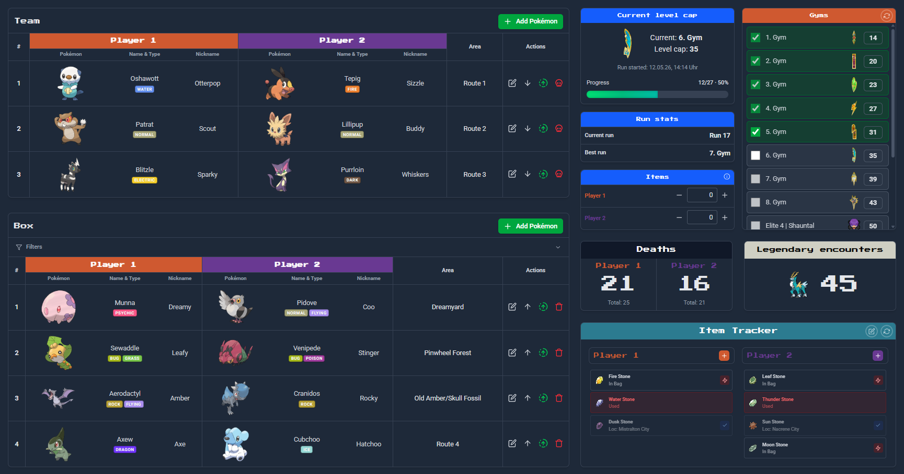
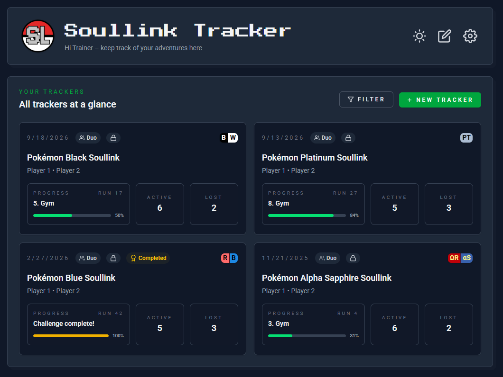

<h1 align="center">
    
   
    Soullink Tracker
   
</h1>

<h4 align="center">
  <b>A real-time Pokémon Soullink & Nuzlocke Tracker - built for streamers, friends and fans of the Nuzlocke genre.</b>
</h4>

  &nbsp;
  &nbsp;
  &nbsp;
  &nbsp;
  &nbsp;

  
  

## What is Soullink Tracker?

It is an open-source web app for managing Pokémon **Soullink** and **Nuzlocke** runs. You can track your
links/catches, cleared routes, progression, items and more.

You can use it together with friends for organizing your runs, or use it as a streamer, and give access to your moderators for managing and share your progress with your viewers.

## ✨ Features

### Tracking

- **Pokémon linking** - Directly pair Pokémon links and add the catch area
- **Progression & level caps** - Badges/Gyms, Rival battles, and Elite Four, all with provided level caps
- **Evolution handling** - Evolve Pokémon and check for evolution method and requirements inside the Tracker
- **Item Tracker** - Track your found Fossils, Evolution stones, Mega stones, and other items. Reviving a fossil automatically creates a new link

### Collaboration

- **Solo, Duo & Trio** - The Tracker supports Solo-Nuzlocking, up to Trio-Soullink
- **Public / Read-only mode** - Share your tracker with stream viewers or guests, enabling them to inspect your progress
- **Custom rulesets** - Use built-in presets or create and save your own rules, great for streamers, to keep your viewers on the same page
- **Real-time collaboration** - All players see changes instantly, making it very easy to use the tracker together and keep everyone up to date

### Special features

- **Version-awareness** - Pokémon, Routes, and Items are filtered and autocompleted based on the game version you're playing
- **Team management** - Filter, hide and sort your links by type to find the best possible team for you run
- **Wiki integration** - Open your preferred Wiki (PokéWiki, Bulbapedia, PokémonDB) directly from within the Tracker
- **Localization** - Full English and German support

## 🎮 Supported Versions

The tracker provides **gyms/badges and rival battles with the respective level caps** for all mainline games up to Generation 6.
Newer generations introduced non-gym progression (trials / challenges), so they are not included by default. But you have
two options, to expand the supported versions

- Version Override
  Although the tracker supports all Pokémon, Routes and Items, they are filtered based on the game version you selected
  when creating a Tracker. You can override this behavior and allow it, to show Pokémon and Items from any version, which
  is perfect for ROM hacks, that take place in older regions.

Planned for the future:

- Custom Tracker
  Creating a custom Tracker requires you to provide your own gyms/badges, rival battles and level caps. This way you can
  add any game you desire, like Gen 7+ or fan games.

<b>Version overview</b>

| Generation | Versions                                                                                                                                                          |
| ---------- | ----------------------------------------------------------------------------------------------------------------------------------------------------------------- |
| **Gen 1**  |                                                                |
| **Gen 2**  |                                                            |
| **Gen 3**  |    |
| **Gen 4**  |     |
| **Gen 5**  |                                               |
| **Gen 6**  |                                                                 |
| **Gen 7+** | Custom Trackers                                                                                                                                                   |

## 🛠 Tech Stack

| Layer        | Technology                           |
| ------------ | ------------------------------------ |
| **Frontend** | React 19 · TypeScript · Tailwind CSS |
| **Backend**  | Supabase · PostgreSQL                |
| **Build**    | Vite                                 |
| **Data**     | PokéAPI · PokéWiki                   |

## 🤝 Contributing

Contributions are welcome! Check out the **[Contributing Guide](https://github.com/joos-too/soullink-tracker?tab=contributing-ov-file)** for everything you need - local
setup, architecture overview, coding conventions, and how to submit a pull request.

_Have an idea or found a bug? [Open an issue!](https://github.com/joos-too/soullink-tracker/issues)_

## 📝 Credits & Acknowledgments

| Resource                                              | Usage                                          |
| ----------------------------------------------------- | ---------------------------------------------- |
| [PokéAPI](https://pokeapi.co/)                        | Pokémon data (types, evolution chains/methods) |
| [PokéAPI Sprites](https://github.com/PokeAPI/sprites) | Pokémon & badge sprites                        |
| [PokéWiki](https://www.pokewiki.de/)                  | Item version info, Item & rival sprites        |

---

  
    Pokémon and all related names and characters are trademarks of their respective owners. 
    © 2026 Pokémon. © 1995–2026 Nintendo / Creatures Inc. / GAME FREAK inc. 
    This is a fan-made, non-commercial project not affiliated with, endorsed by, or sponsored by any of these companies.
  

